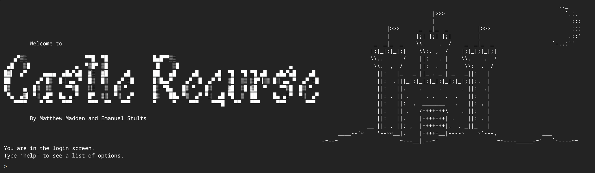
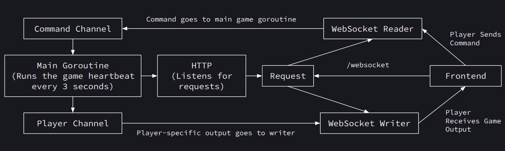
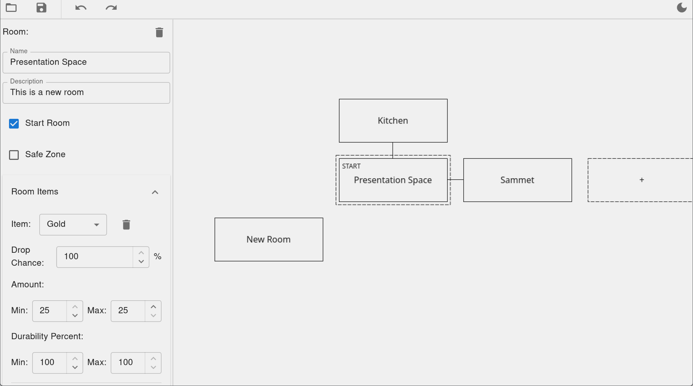

# Castle Recurse



Castle Recurse is a [Multi-User Dungeon](https://en.wikipedia.org/wiki/Multi-user_dungeon) (a multiplayer online text adventure game) developed for the Recurse Center. The game is still in active development.

## Dependencies
 - Go
 - NodeJS
 - NPM

 ## Running the Project
 
1. Clone the repo
2. Put the `env.json` file into the root of the `backend/` folder
3. Run the backend in one terminal
```
cd backend
go run .
```

4. In another terminal, install frontend dependencies and run the frontend
```
cd frontend
npm install

npm run dev
```

5. Access the frontend by navigating to `localhost:5173` in your browser.

## Project Architecture

The game runs on a Go backend server and players connect using a companion React frontend. The frontend contains no game logic and is just a plain terminal which sends and receives messages.

Users login from the frontend via Recurse OAuth. Once logged in, their client establishes a websocket connection with the server, and the rest of gameplay happens through this websocket connection.

Since this is a realtime multiplayer game, good concurrency is an important part of keeping the game running. Pictured below is a flow of the game's concurrency scheme.



- The main goroutine handles gameplay
  - Gameplay happens on a 3 second server tick
  - All game logic is single-threaded 
- A separate goroutine runs an HTTP server and listens for requests
  - Each new HTTP request spawns a separate goroutine to handle the request (this is the default behavior for http in Go)
- When a websocket connection is made between client and server, two goroutines are established to run the connection
  - The WebSocket Reader routine listens for messages from the client and sends them to the game
  - The WebSocket Writer routine listens for messages from the game and sends them to the client
  - Go's channels feature is used to facilitate this communication. Messages can be sent between the game and the client's web socket connection without explicit synchronization on the application side

## World Editor



The world editor allows developers to edit the game world without manually typing out the world JSON. The editor is a separate self-contained full stack web app that lives inside the `./editor` folder. The editor should not be run at the same time as the backend or frontend.

The easiest way to run the editor is to run `just dev` (which requires that you have [Just](https://github.com/casey/just) installed). This will 1. start the backend, 2. start the frontend, and 3. open up the frontend in a separate Chrome window. When you close the Chrome window, the frontend and backend will also shutdown.

If you don't have Just or Chrome, you can also run each piece manually:

1. Start the backend: `cd editor && go run .`
2. In a separate terminal, start the frontend: `cd editor/frontend && npm run dev`
3. Navigate to `localhost:5173` in your browser.

### Generating TypeScript Types

The editor frontend uses TypeScript versions of the Go types that the editor server sends to it (`EditorWorld`, `world.Room`, the enums in `editor/enums.go`, etc). These live in `editor/frontend/src/api/models.ts`, which is generated, so don't edit it by hand. After changing any of those Go types, regenerate it:

```
cd editor
go generate
```

`go generate` is a built-in Go tool command. It scans the package's source files for comments of the form `//go:generate <command>` and runs each command. `editor/main.go` contains:

```go
//go:generate go run . -generate-types frontend/src/api/models.ts
```

So `go generate` just runs the editor program with the `-generate-types` flag. When `main()` sees that flag, it calls `generateModels()` (in `editor/models_gen.go`) instead of starting the server. `generateModels()` uses reflection to walk the registered Go types, converts them to TypeScript with a copy of Wails' typescriptify (`editor/internal/typescriptify`), writes the result to the given path, and exits.
