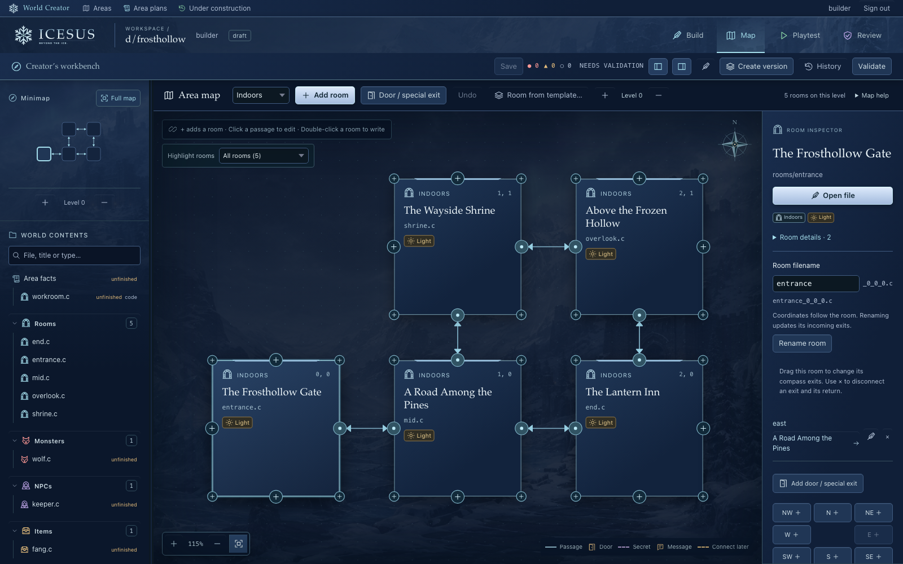

# Castle Recurse World Editor

The world editor is a tool used to aid in content development for Castle Recurse and for other games which might use its codebase. The editor is a hybrid visual and code editor. Users of this editor understand that game data is made up of Lua scripts, and they aren't afraid to get their hands dirty with Lua scripting. This editor blends layout positioning of rooms with a built-in code editor that allows users to edit content of the game's scripts right there in the editor.

## Inspiration Pictures




## Architecture

The editor is not a standalone application. It is built on top of an existing code editor (VS Code), which already provides most of what an author needs: a file explorer, a code editor, vim bindings (through the VSCodeVim extension), and Lua syntax support (through the lua-language-server extension, "LuaLS"). The work of this project is split into three pieces, of which only the last is tied to a specific editor.

### 1. Validation language server (Go)

The game binary gets an `lsp` subcommand (e.g. `mud lsp`) that speaks the Language Server Protocol over stdio. It validates the world's data by running the same loader the game server uses, so validation logic exists in exactly one place.

- The loader reads scripts through an `fs.FS`. The language server gives it an overlay filesystem that serves the contents of unsaved editor buffers on top of the files on disk.
- On each change (debounced), the server re-runs the loader over the whole data folder and publishes diagnostics for every file. This is what makes errors that span files work: deleting an item publishes errors on every room whose loot table names it.
- Because it is a standard language server, it works in any editor with LSP support (VS Code, Zed, Neovim, Helix), not only in the extension below.

### 2. Lua definitions for the script API

`backend/data/world.d.lua` is a LuaLS definition file generated from `backend/world/script_library.go` (see `backend/generate/luadefs.go`). LuaLS uses it to complete `world.` functions and constants and to warn when a script calls one that doesn't exist. This needs no work from the validation server.

### 3. VS Code extension

A TypeScript VS Code extension that:

- Starts `mud lsp` as its language client (using `vscode-languageclient`).
- Registers a custom editor (`CustomTextEditorProvider`) for `layout.json`, which renders the map view in a webview. See "Map View" below.

The extension's source lives in a top-level `editor/` folder next to `backend/` and `frontend/`. `npm` builds it into a `.vsix` that authors install by hand. Publishing to the VS Code Marketplace and Open VSX (for VSCodium and other VS Code forks) is left for later.

Authors open the folder that contains their data folder (for example, `backend/`), not the data folder itself. The extension has two settings:

- `mud.serverPath`: the `mud` binary used to run `mud lsp`. Defaults to `mud` on `PATH`.
- `mud.dataFolder`: the data folder, relative to the workspace root. Defaults to `data`. The extension passes it to `mud lsp` and opens the map view for the `layout.json` inside it.

### Other editors

Zed extensions can add language servers but can't draw custom UI, so Zed (and other LSP-capable editors) get validation and Lua definitions but no map view. Authors using them edit the layout file as JSON. The map view is written as a self-contained web component that talks to its host through a small message interface. If a map view outside VS Code is needed later, the game server could host the same component in a dev mode.

## Scope and User Stories

For all these user stories, an "author" is defined to be a user of the level editor who is making content for the game.

### File Explorer
As an author, I can view the Lua files of my game via a file explorer on the left-hand side of the editor.
I can create, delete, and rename files through this view.
I can create new subfolders and move files around among subfolders through this view.

All of this is provided by VS Code's explorer.

The core data folders ("backgrounds", "items", "races", "rooms", "npcs") should not be deleted. VS Code can't stop a user deleting a folder from its explorer, so instead the validation server reports an error when a core folder is missing.

### Code Editor
As an author, when I click on a file in the file explorer, I can edit its contents using a code editor that occupies the majority of the editor screen.
The sidebar should still be visible while the code editor is open.
The code editor should support the option to use vim bindings.
The code editor should be Lua syntax aware as well as script-error aware (see the "Script Errors" story).

All of this is provided by VS Code, VSCodeVim, LuaLS and the validation server. The map view and code editors open as editor tabs, so the author can choose to see one at a time or split them side by side.

### Script Errors
As an author, I want to receive realtime information about when my script has errors.
For example, when I type an item name into a loot table which is invalid, an error squiggle should indicate the error and hovering the text should reveal an error message telling me what the problem is.
When multiple files have errors, I should see the error across all of the files. For example, when I delete an item, if deleting that item would invalidate the loot table on multiple rooms, I should see the error on all those files. This should be indicated in the code editor if I have one of those files open. This should also be indicated in the file explorer, because the file explorer should visually flag scripts that have errors.
The editor and file explorer should also flag files that have warnings, because warnings will surface when, for example, a user types the wrong name in for a script library (`world.`) function.

The validation server publishes errors; LuaLS publishes the `world.` warnings. VS Code shows both in open editors, in the Problems panel, and as colored entries in the file explorer.

What is not in scope: the editor is not responsible for running behavior functions and ensuring that they do not crash at runtime. An example of "behavior functions" includes spell `on_cast()`, item `on_use()`, and room `reset()`.

Required changes to the loader:

- It must collect problems from every file instead of stopping at the first failing file, so that all errors can be reported at once.
- Each problem must carry the file it came from and the key of the field it is about (for example, `item` in a loot entry), so the editor can place a squiggle on the right line.

The validation server finds a problem's line by searching the file's source text for the field's key. When the key appears more than once in a file, the squiggle may land on the wrong occurrence; this is accepted. A problem with no field, or whose key isn't found, is placed on the first line of the file.

### Map View
As an author, I want to be able to open a map view which allows me to place rooms and manage the rooms layout. The map view is a custom editor for the layout file: opening the layout file in VS Code opens the map view.
In this view, I can click on an empty cell in the grid to create a room.
In this view, I can right-click on the map to pan the view.
In this view, I can zoom in and out of the map using the scroll wheel.
In this view, I can click on the space between cells to create connections between rooms. While hovering the space between cells, I can see a dotted line indicating that a connection will be made when I click there. A solid line is shown for established cell-to-cell connections.
In this view, I can use +/- icons in the top-right corner of the view to edit my current viewing elevation. This changes the Z-level of the rooms that I am seeing. I can only see rooms at the current Z-level. When I create a new room, the room is created at the Z-level I am viewing.
In this view, I can see up or down arrows in the top-right corner of each room indicating whether the room has an up-or-down connection. If a room has another room above or below it to which it is not connected, then hovering over the place where the up/down arrows would be reveals a dotted up/down arrow, and clicking on this up/down arrow establishes a connection between the room above or below it.
When a room is deleted, all connections between the room are deleted without issue.
Creating a room in the editor does not create a new Lua file, instead it creates a new empty room which has not yet been assigned a Lua file. As an author, I can use the map view to assign rooms to Lua files. For more on this, see the "Layout" section below.
In this view, each room shows the `name` from its Lua file. A room whose file is missing or fails to load shows its file name instead, and an unassigned room shows as empty.
In this view, I can drag a room to an empty cell on the same Z-level to move it. Moving a room removes all of its connections, since its neighbors are different at the new position.
In this view, I can double-click a room that has a Lua file to open that file in a code editor tab.
In this view, I can create a Lua file for an unassigned room. The editor asks for a file name, creates `rooms/<name>.lua` from a room template, and assigns it to the room.
When a room is deleted, its Lua file is left alone. Only the room's layout entry and its connections are removed, and the file can be assigned to another room.
As an author, I can undo and redo any edit made in the map view. Creating a Lua file for a room is not undone by the map view's undo; undo only removes the room's assignment.

Implementation notes:

- The map view is a webview. It and the extension exchange messages with `postMessage`.
- Every map edit is applied as a `WorkspaceEdit` to the layout file's text document. VS Code's own text buffer then provides undo/redo, unsaved-changes state and saving, so the map view does not need its own command stack.
- When the layout document changes, including when the author edits the JSON directly, the extension sends the new state to the webview and it redraws.
- Room names come from the validation server through a custom LSP request (for example, `mud/roomNames`), which returns the name of each room file it loaded successfully. The extension forwards the result to the webview and requests it again whenever the server republishes diagnostics.

## Layout

Room position and exits are stored in `layout.json` at the root of the data folder rather than in the room Lua files, so that the editor never has to surgically edit Lua. Room Lua files no longer have `position` or `exits` fields.

`layout.json` contains an array of rooms. Each room has:

- `position`: an XYZ coordinate. A room's position is its identity, so no two rooms may share one.
- `path`: the path to the room's Lua file, relative to the `rooms` folder. Empty for a room that hasn't been assigned a file yet.
- `exits`: a list of directions (`"north"`, `"east"`, `"south"`, `"west"`, `"up"`, `"down"`) leading to the adjacent room in that direction.

```json
{
    "rooms": [
        { "position": { "x": 0, "y": 0, "z": 0 }, "path": "presentation_space.lua", "exits": ["west", "up"] },
        { "position": { "x": -1, "y": 0, "z": 0 }, "path": "kitchen.lua", "exits": ["east"] }
    ]
}
```

Exits are two-way. Every exit must have a matching exit in the opposite direction on the adjacent room, and the validation server reports an error on `layout.json` when it doesn't, or when an exit leads to a position with no room. The map view always edits both sides of a connection together, so it never creates a mismatch; mismatches only come from editing the JSON by hand.

When an author creates a new room in the editor, it creates a new room entry in the layout with an empty path. The author can assign a path to a room from the map view by:

- Choosing a room file from a quick-pick list of the files in the `rooms` folder.
- Dragging a room Lua file from the file explorer onto the room. (VS Code requires the author to hold Shift while dropping into a webview, so this is a secondary way to assign a path.)

Part of the validation step on the world's data should be that all rooms in the layout are associated with valid Room Lua files. A room with an empty path, or a path to a file that doesn't exist or isn't a valid room, is an error. The game server refuses to start while any such error exists, the same as for any other invalid world data. It is ok for the same Room Lua to be used on multiple cells, though this is perhaps strange, and a warning should be issued to users when this happens in case this was a mistake.

## Out of Scope

- Talking to a running game server, for example to hot-reload scripts while connected as a player. The editor only edits and validates files.
- Marking rooms with errors or warnings on the map itself. Errors show in the code editor, the Problems panel and the file explorer.
- Publishing the extension to the VS Code Marketplace or Open VSX.
